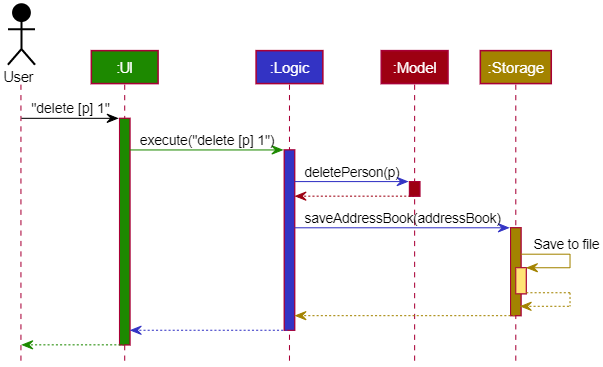
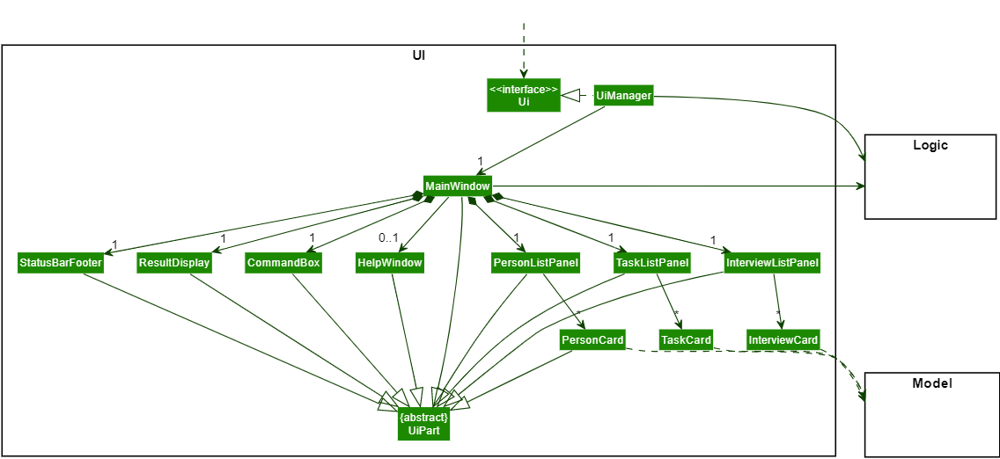
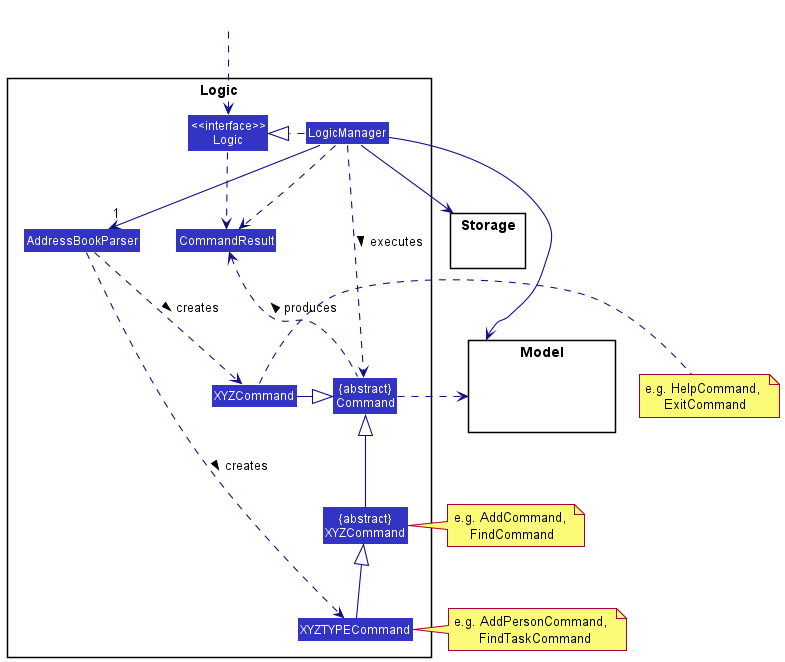
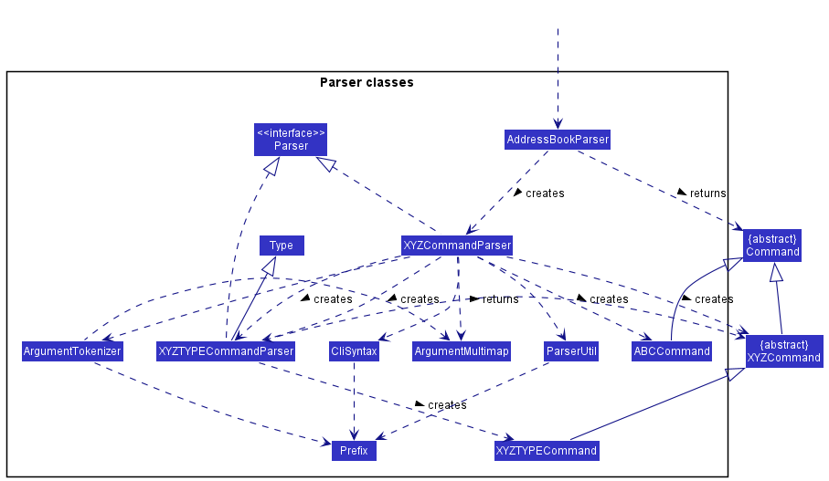
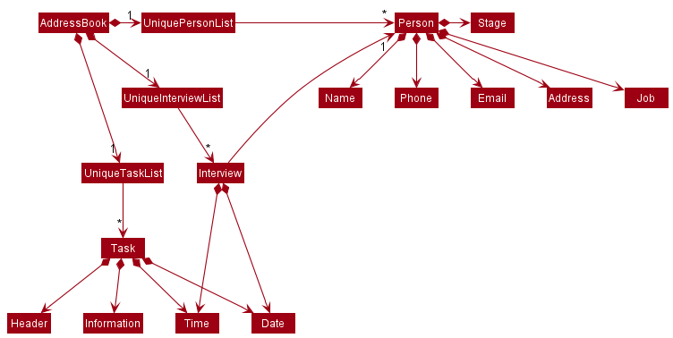
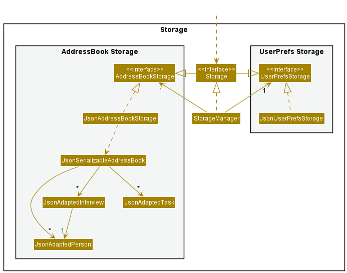

* Table of Contents
{:toc}

--------------------------------------------------------------------------------------------------------------------

## **Acknowledgements**

* {list here sources of all reused/adapted ideas, code, documentation, and third-party libraries -- include links to the original source as well}

--------------------------------------------------------------------------------------------------------------------

## **Setting up, getting started**

Refer to the guide [_Setting up and getting started_](SettingUp.md).

--------------------------------------------------------------------------------------------------------------------

## **Design**

:bulb: **Tip:** The `.puml` files used to create diagrams in this document can be found in the [diagrams](https://github.com/se-edu/addressbook-level3/tree/master/docs/diagrams/) folder. Refer to the [_PlantUML Tutorial_ at se-edu/guides](https://se-education.org/guides/tutorials/plantUml.html) to learn how to create and edit diagrams.

### Architecture

The ***Architecture Diagram*** given above explains the high-level design of the App.

Given below is a quick overview of main components and how they interact with each other.

**Main components of the architecture**

**`Main`** has two classes called [`Main`](https://github.com/se-edu/addressbook-level3/tree/master/src/main/java/seedu/address/Main.java) and [`MainApp`](https://github.com/se-edu/addressbook-level3/tree/master/src/main/java/seedu/address/MainApp.java). It is responsible for,
* At app launch: Initializes the components in the correct sequence, and connects them up with each other.
* At shut down: Shuts down the components and invokes cleanup methods where necessary.

[**`Commons`**](#common-classes) represents a collection of classes used by multiple other components.

The rest of the App consists of four components.

* [**`UI`**](#ui-component): The UI of the App.
* [**`Logic`**](#logic-component): The command executor.
* [**`Model`**](#model-component): Holds the data of the App in memory.
* [**`Storage`**](#storage-component): Reads data from, and writes data to, the hard disk.

**How the architecture components interact with each other**

The *Sequence Diagram* below shows how the components interact with each other for the scenario where the user issues the command `delete 1`.

Each of the four main components (also shown in the diagram above),

* defines its *API* in an `interface` with the same name as the Component.
* implements its functionality using a concrete `{Component Name}Manager` class (which follows the corresponding API `interface` mentioned in the previous point.

For example, the `Logic` component defines its API in the `Logic.java` interface and implements its functionality using the `LogicManager.java` class which follows the `Logic` interface. Other components interact with a given component through its interface rather than the concrete class (reason: to prevent outside component's being coupled to the implementation of a component), as illustrated in the (partial) class diagram below.

The sections below give more details of each component.

### UI component

The **API** of this component is specified in [`Ui.java`](https://github.com/se-edu/addressbook-level3/tree/master/src/main/java/seedu/address/ui/Ui.java)

The UI consists of a `MainWindow` that is made up of parts e.g.`CommandBox`, `ResultDisplay`, `PersonListPanel`, `StatusBarFooter` etc. All these, including the `MainWindow`, inherit from the abstract `UiPart` class which captures the commonalities between classes that represent parts of the visible GUI.

The `UI` component uses the JavaFx UI framework. The layout of these UI parts are defined in matching `.fxml` files that are in the `src/main/resources/view` folder. For example, the layout of the [`MainWindow`](https://github.com/se-edu/addressbook-level3/tree/master/src/main/java/seedu/address/ui/MainWindow.java) is specified in [`MainWindow.fxml`](https://github.com/se-edu/addressbook-level3/tree/master/src/main/resources/view/MainWindow.fxml)

The `UI` component,

* executes user commands using the `Logic` component.
* listens for changes to `Model` data so that the UI can be updated with the modified data.
* keeps a reference to the `Logic` component, because the `UI` relies on the `Logic` to execute commands.
* depends on some classes in the `Model` component, as it displays `Person` object residing in the `Model`.

### Logic component

**API** : [`Logic.java`](https://github.com/se-edu/addressbook-level3/tree/master/src/main/java/seedu/address/logic/Logic.java)

Here's a (partial) class diagram of the `Logic` component:

How the `Logic` component works:
1. When `Logic` is called upon to execute a command, it uses the `AddressBookParser` class to parse the user command.
1. This results in a `Command` object (more precisely, an object of one of its subclasses e.g., `AddCommand`) which is executed by the `LogicManager`.
1. The command can communicate with the `Model` when it is executed (e.g. to add a person).
1. The result of the command execution is encapsulated as a `CommandResult` object which is returned back from `Logic`.

The Sequence Diagram below illustrates the interactions within the `Logic` component for the `execute("delete 1")` API call.

:information_source: **Note:** The lifeline for `DeleteCommandParser` should end at the destroy marker (X) but due to a limitation of PlantUML, the lifeline reaches the end of diagram.

Here are the other classes in `Logic` (omitted from the class diagram above) that are used for parsing a user command:

How the parsing works:
* When called upon to parse a user command, the `AddressBookParser` class creates an `XYZCommandParser` (`XYZ` is a placeholder for the specific command name e.g., `AddCommandParser`) which uses the other classes shown above to parse the user command and create a `XYZCommand` object (e.g., `AddCommand`) which the `AddressBookParser` returns back as a `Command` object.
* All `XYZCommandParser` classes (e.g., `AddCommandParser`, `DeleteCommandParser`, ...) inherit from the `Parser` interface so that they can be treated similarly where possible e.g, during testing.

### Model component
**API** : [`Model.java`](https://github.com/se-edu/addressbook-level3/tree/master/src/main/java/seedu/address/model/Model.java)

The `Model` component,

* stores the address book data i.e., all `Person` objects (which are contained in a `UniquePersonList` object).
* stores the currently 'selected' `Person` objects (e.g., results of a search query) as a separate _filtered_ list which is exposed to outsiders as an unmodifiable `ObservableList<Person>` that can be 'observed' e.g. the UI can be bound to this list so that the UI automatically updates when the data in the list change.
* stores a `UserPref` object that represents the user’s preferences. This is exposed to the outside as a `ReadOnlyUserPref` objects.
* does not depend on any of the other three components (as the `Model` represents data entities of the domain, they should make sense on their own without depending on other components)

:information_source: **Note:** An alternative (arguably, a more OOP) model is given below. It has a `Tag` list in the `AddressBook`, which `Person` references. This allows `AddressBook` to only require one `Tag` object per unique tag, instead of each `Person` needing their own `Tag` objects. 

### Storage component

**API** : [`Storage.java`](https://github.com/se-edu/addressbook-level3/tree/master/src/main/java/seedu/address/storage/Storage.java)

The `Storage` component,
* can save both address book data and user preference data in json format, and read them back into corresponding objects.
* inherits from both `AddressBookStorage` and `UserPrefStorage`, which means it can be treated as either one (if only the functionality of only one is needed).
* depends on some classes in the `Model` component (because the `Storage` component's job is to save/retrieve objects that belong to the `Model`)

### Common classes

Classes used by multiple components are in the `seedu.addressbook.commons` package.

--------------------------------------------------------------------------------------------------------------------

## **Implementation**

This section describes some noteworthy details on how certain features are implemented.

### \[Proposed\] Undo/redo feature

#### Proposed Implementation

The proposed undo/redo mechanism is facilitated by `VersionedAddressBook`. It extends `AddressBook` with an undo/redo history, stored internally as an `addressBookStateList` and `currentStatePointer`. Additionally, it implements the following operations:

* `VersionedAddressBook#commit()` — Saves the current address book state in its history.
* `VersionedAddressBook#undo()` — Restores the previous address book state from its history.
* `VersionedAddressBook#redo()` — Restores a previously undone address book state from its history.

These operations are exposed in the `Model` interface as `Model#commitAddressBook()`, `Model#undoAddressBook()` and `Model#redoAddressBook()` respectively.

Given below is an example usage scenario and how the undo/redo mechanism behaves at each step.

Step 1. The user launches the application for the first time. The `VersionedAddressBook` will be initialized with the initial address book state, and the `currentStatePointer` pointing to that single address book state.

Step 2. The user executes `delete 5` command to delete the 5th person in the address book. The `delete` command calls `Model#commitAddressBook()`, causing the modified state of the address book after the `delete 5` command executes to be saved in the `addressBookStateList`, and the `currentStatePointer` is shifted to the newly inserted address book state.

Step 3. The user executes `add n/David …​` to add a new person. The `add` command also calls `Model#commitAddressBook()`, causing another modified address book state to be saved into the `addressBookStateList`.

:information_source: **Note:** If a command fails its execution, it will not call `Model#commitAddressBook()`, so the address book state will not be saved into the `addressBookStateList`.

Step 4. The user now decides that adding the person was a mistake, and decides to undo that action by executing the `undo` command. The `undo` command will call `Model#undoAddressBook()`, which will shift the `currentStatePointer` once to the left, pointing it to the previous address book state, and restores the address book to that state.

:information_source: **Note:** If the `currentStatePointer` is at index 0, pointing to the initial AddressBook state, then there are no previous AddressBook states to restore. The `undo` command uses `Model#canUndoAddressBook()` to check if this is the case. If so, it will return an error to the user rather
than attempting to perform the undo.

The following sequence diagram shows how the undo operation works:

:information_source: **Note:** The lifeline for `UndoCommand` should end at the destroy marker (X) but due to a limitation of PlantUML, the lifeline reaches the end of diagram.

The `redo` command does the opposite — it calls `Model#redoAddressBook()`, which shifts the `currentStatePointer` once to the right, pointing to the previously undone state, and restores the address book to that state.

:information_source: **Note:** If the `currentStatePointer` is at index `addressBookStateList.size() - 1`, pointing to the latest address book state, then there are no undone AddressBook states to restore. The `redo` command uses `Model#canRedoAddressBook()` to check if this is the case. If so, it will return an error to the user rather than attempting to perform the redo.

Step 5. The user then decides to execute the command `list`. Commands that do not modify the address book, such as `list`, will usually not call `Model#commitAddressBook()`, `Model#undoAddressBook()` or `Model#redoAddressBook()`. Thus, the `addressBookStateList` remains unchanged.

Step 6. The user executes `clear`, which calls `Model#commitAddressBook()`. Since the `currentStatePointer` is not pointing at the end of the `addressBookStateList`, all address book states after the `currentStatePointer` will be purged. Reason: It no longer makes sense to redo the `add n/David …​` command. This is the behavior that most modern desktop applications follow.

The following activity diagram summarizes what happens when a user executes a new command:

#### Design considerations:

**Aspect: How undo & redo executes:**

* **Alternative 1 (current choice):** Saves the entire address book.
  * Pros: Easy to implement.
  * Cons: May have performance issues in terms of memory usage.

* **Alternative 2:** Individual command knows how to undo/redo by
  itself.
  * Pros: Will use less memory (e.g. for `delete`, just save the person being deleted).
  * Cons: We must ensure that the implementation of each individual command are correct.

_{more aspects and alternatives to be added}_

### Editing a person's details

#### Overview:
The edit command is able to edit 1 or more fields of details of a single person at a time.   
For example, `edit 2 n/John Doe` edits the name of the 2nd indexed person within the contact list.  
While `edit 2 n/John Doe p/98181234 j/2 INPROGRESS` edits the name, phone number and job application details
of the 2nd indexed person.   
The edit command requires the index of the person you wish to edit, for example `edit n/Bob` will result
in an invalid input while `edit 1 n/Bob` is a valid input.  
Each specified field of detail cannot be an empty string input, for example `edit 1 a/` will not work.  

### Searching for persons with keywords

#### Overview:
The find feature uses the `g/` flag to simulate an AND operator. It checks if the data of current person contains all
the keywords in the flag. For example, `find g/john orchard 111` finds all persons whose data contains `john`
**AND** `orchard` **AND** `111`.

Chaining together several `g/` flags simulates an OR operator. For example, `find g/john g/orchard g/111` 
finds all persons whose data contains `john` **OR** `orchard` **OR** `111`.

The find feature uses 2 keywords to distinguish application details from personal details. Namely `jobid:` and 
`progress:`. If either parameters are misspelled, the find feature will treat these parameters as normal search terms 
instead of special keywords.

`jobid:` Checks if the person is applying for that specific job id.

`progress:` Checks if the person is currently at that particular stage of the job application.

#### Implementation Steps
1. When the Find Command parses the query, it gets searches for all the `g/` flags and tokenizes the search terms wrapped
inside the `g/` flag.
   1. If any of the flags are empty, throw a new exception stating that the `g/` flag is empty
   2. If parser cannot find and `g/` flag, throw a new exception stating that no `g/` flags can be found
2. Create a new object in `PersonContainsKeywordsPredicate` with the list of search terms.
3. Return a new `FindCommand` object using the newly created object from the previous step.
4. smth smth

The following sequence diagram shows how the find operation works:

The following activity diagram summarizes what happens when a user executes a new command:

&nbsp;
#### Design considerations:
* **Alternative 1:** Using AND, OR, NOT operators (i.e. `find john AND tom OR (gmail.com AND NOT 111)`).
  * Pros: More intuitive to the technically inclined and more control over the search results.
  * Cons: Harder to parse and implement.
* **Alternative 2:** Enforcing the usage of flags for every search term (i.e. `find n/john p/123 e/john n/lee`)
  * Pros: More control over the search query.
  * Cons: Search query becomes long especially if search term appears in multiple fields.
* **Alternative 3** Using free text queries (i.e. `find john tom gmail.com`)
  * Pros: More intuitive as user expects queried person to contain all the search terms.
  * Cons: Lacks the flexibility provided by AND and OR operators.

--------------------------------------------------------------------------------------------------------------------

## **Documentation, logging, testing, configuration, dev-ops**

* [Documentation guide](Documentation.md)
* [Testing guide](Testing.md)
* [Logging guide](Logging.md)
* [Configuration guide](Configuration.md)
* [DevOps guide](DevOps.md)

--------------------------------------------------------------------------------------------------------------------

## **Appendix: Requirements**

### Product scope

**Target user profile**: Tech HR Recruiters

* has a need to manage a significant number of contacts
* prefer desktop apps over other types
* can type fast
* prefers typing to mouse interactions
* is reasonably comfortable using CLI apps

**Value proposition**:
* manage contacts faster than a typical mouse/GUI driven app
* categorize applicants based on job role they are interested in & current stage of application process
* consolidate/group applicants and employers of relevant department together
* keep track of applicant's interviews/upcoming calls
* task list for themselves to keep track of miscellaneous things

### User stories

Priorities: High (must have) - `* * *`, Medium (nice to have) - `* *`, Low (unlikely to have) - `*`

| Priority | As a …​                                                                                                               | I want to …​                                                                                                            | So that I can…​                                                                                     |
|----------|-----------------------------------------------------------------------------------------------------------------------|-------------------------------------------------------------------------------------------------------------------------|-----------------------------------------------------------------------------------------------------|
| `*`      | Tech HR Recruiter                                                                                                     | share information with other recruiters                                                                                 | easily liaise with them                                                                             |
| `* * *`  | Tech HR Recruiter                                                                                                     | rank applicants                                                                                                         | find out who to contact in the event the top few applicants reject the offer                        |
| `* * *`  | Tech HR Recruiter                                                                                                     | categorize employers by the job position they are hiring for                                                            | find out who to contact regarding a specific job position                                           |
| `*`      | Tech HR Recruiter                                                                                                     | utilise a task list                                                                                                     | keep track of my daily schedule                                                                     |
| `*`      | Tech HR Recruiter                                                                                                     | schedule meetings/interviews between employers and applicants                                                           | help them progress in the application process                                                       |
| `* *`    | Tech HR Recruiter                                                                                                     | easily view the details of a contact without needing to click on their profile                                          | skim through my contacts quickly                                                                    |
| `* *`    | Tech HR Recruiter                                                                                                     | send applicant details to respective employers                                                                          | delegate information seamlessly                                                                     |
| `*`      | Tech HR Recruiter                                                                                                     | easily view the applicants social media page                                                                            | gain some insight into how they carry themselves                                                    |
| `* * *`  | Tech HR Recruiter                                                                                                     | sort contacts by name                                                                                                   | find the right contact easily                                                                       |
| `* * *`  | tech HR recruiter                                                                                                     | list all the applicants and employers that are in my address book.                                                      |                                                                                                     |
| `* * *`  | tech HR recruiter                                                                                                     | add an applicant's contact information in my address book                                                               | keep track of who might be a suitable applicant                                                     |
| `* * *`  | tech HR recruiter                                                                                                     | add an employer's contact information in my address book                                                                | keep track of who is currently looking for people to hire                                           |
| `* * *`  | tech HR recruiter                                                                                                     | delete applicants or employers from my address book                                                                     | remove unnecessary data                                                                             |
| `* * *`  | tech HR recruiter                                                                                                     | update applicants or employers contact in my address book                                                               | easily edit their contact details without needing to delete them                                    |
| `* * *`  | tech HR recruiter                                                                                                     | search up an applicant or an employer easily                                                                            | view all their details and information quickly instead of needing to scroll through the entire list |
| `*`      | tech HR recruiter                                                                                                     | send an email to any contact                                                                                            | easily communicate anything                                                                         |
| `*`      | tech HR recruiter                                                                                                     | view which applicants have required but missing information                                                             | quickly contact them to request it                                                                  |
| `*`      | tech HR recruiter                                                                                                     | sort the applicants into different containers based on their job application                                            | easily find who are the potential candidates for that job role                                      |
| `*`      | tech HR recruiter                                                                                                     | sort the applicants into different containers based on their current application process                                | easily identify what is the next stage in their application                                         |
| `*`      | tech HR recruiter                                                                                                     | parse the information of the applicants                                                                                 | easily understand the strengths and weaknesses of the applicants                                    |
| `*`      | tech HR recruiter                                                                                                     | sort job descriptions based on priority levels (based on date deadline)                                                 | settle more urgent job descriptions first                                                           |
| `*`      | tech HR recruiter                                                                                                     | select multiple contacts to group together                                                                              | easily create a group with the desired contacts                                                     |
| `*`      | tech HR recruiter                                                                                                     | consolidate similar job descriptions to the job role that the applicant has applied for and push them out to applicants | mass send job openings to applicants                                                                |
| `*`      | tech HR recruiter                                                                                                     | I can send an email to multiple contacts at a time                                                                      | can easily broadcast anything.                                                                      |
| `*`      | tech HR recruiter, I can reach out to other recruiters in my network                                                  | can connect with them.                                                                                                  |                                                                                                     |
| `* * *`  | tech HR recruiter, I can easily view the status of the applicant’s application process                                | can follow up on it.                                                                                                    |                                                                                                     |
|
| `* * *`  | tech HR recruiter, I can automatically remove applicants who already successfully found a job                         | can keep the list of applicants well updated.                                                                           |                                                                                                     |
| `*`      | tech HR recruiter, I can find applicants who are taking too long to move to the next stage of the application process | can follow up on it                                                                                                     |                                                                                                     |
|
| `* * *`  | tech HR recruiter, I can favorite contacts                                                                            | can easily see who to take note of.                                                                                     |                                                                                                     |
| `*`      | tech HR recruiter, I can set up meetings/HR calls with the potential applicants                                       | can easily reach out to the applicants.                                                                                 |                                                                                                     |

*{More to be added}*

### Use cases

(For all use cases below, the **System** is the `HRConnect` and the **Actor** is the `Tech HR Recruiter`, unless specified otherwise)

**Use case: Add a person**

**MSS**

1. User requests to add a person in the address book
2. AddressBook adds the person to person list

    Use case ends.

**Extensions**

* 2a. The type is invalid.

  * 2a1. AddressBook shows an error message.

    Use case only adds person with type field '[p]'.

* 2b. The job position is invalid.

    * 2b1. AddressBook shows an error message.

      Use case only adds contact with valid job position.

**Use case: Add an interview**

**MSS**

1. User requests to add an interview in the address book
2. AddressBook adds the interview to interview list

   Use case ends.

**Extensions**

* 2a. The type is invalid.

    * 2a1. AddressBook shows an error message.

      Use case only adds interview with type field '[i]'.

* 2b. The INDEX is out of bounds.

    * 2b1. AddressBook shows an error message.

      Use case only adds interview with valid index based on length of person list.

**Use case: Delete a person**

**MSS**

1. User requests to delete a person in the address book
2. AddressBook deletes the person from the person list

   Use case ends.

**Extensions**

* 2a. The type is invalid.

    * 2a1. AddressBook shows an error message.

      Use case only deletes person with type field '[p]'.

* 2b. The INDEX is out of bounds.

    * 2b1. AddressBook shows an error message.

      Use case only deletes person with valid index based on length of person list.
  
* 2c. The given person has an interview.

    * 2c1. AddressBook shows an error message.

      Use case only can delete person if person does not have any interviews.

* 2d. The given person does not exist in the database.
    
    * 2d1. AddressBook shows an error message.

      Use case only deletes person with a valid name, provided the person's name exists in the database.

**Use case: Delete an interview**

**MSS**

1. User requests to delete a interview in the address book
2. AddressBook deletes the interview from the interview list

   Use case ends.

**Extensions**

* 2a. The type is invalid.

    * 2a1. AddressBook shows an error message.

      Use case only deletes interview with type field '[i]'.

* 2b. The INDEX is out of bounds.

    * 2b1. AddressBook shows an error message.

      Use case only deletes interview with valid index based on length of interview list.

**Use case: List person list**

**MSS**

1. User requests to see all people in the address book
2. AddressBook display person list

   Use case ends.

**Extensions**

* 2a. The type is invalid.

    * 2a1. AddressBook shows an error message.

      Use case only display people with type field '[p]'.

**Use case: List interview list**

**MSS**

1. User requests to see all interviews in the address book
2. AddressBook display interview list

   Use case ends.

**Extensions**

* 2a. The type is invalid.

    * 2a1. AddressBook shows an error message.

      Use case only display interviews with type field '[i]'.

**Use case: Edit a person's particulars**

**MSS**

1.  User requests to update a specific persons' details
2.  HRConnect shows person with their updated details

    Use case ends.

**Extensions**

* 1a. HRConnect detects an error in the entered data

  * 1a1. HRConnect request for the correct data
  * 1a2. User enters new data

    Steps 1a1 - 1a2 are repeated until the data entered are correct

    Use case resumes from step 2.

*{More to be added}*

### Non-Functional Requirements

1. Should work on any _mainstream OS_ as long as it has Java `11` or above installed.
2. Should be able to hold up to 1000 persons without a noticeable sluggishness in performance for typical usage.
3. A user with above average typing speed for regular English text (i.e. not code, not system admin commands) should be able to accomplish most of the tasks faster using commands than using the mouse.
4. Should only be used by Tech HR Recruiters

*{More to be added}*

### Glossary

* **Mainstream OS**: Windows, Linux, Unix, OS-X

* **Private contact detail**: A contact detail that is not meant to be shared with others

* **Tech HR Recruiters**: a Human Resource specialist that assists in the proper staffing of technical positions within an organization

--------------------------------------------------------------------------------------------------------------------

## **Appendix: Instructions for manual testing**

Given below are instructions to test the app manually.

:information_source: **Note:** These instructions only provide a starting point for testers to work on;
testers are expected to do more *exploratory* testing.

### Launch and shutdown

1. Initial launch

   1. Download the jar file and copy into an empty folder

   1. Double-click the jar file Expected: Shows the GUI with a set of sample contacts. The window size may not be optimum.

1. Saving window preferences

   1. Resize the window to an optimum size. Move the window to a different location. Close the window.

   1. Re-launch the app by double-clicking the jar file. 
       Expected: The most recent window size and location is retained.

1. _{ more test cases …​ }_

### Deleting a person

1. Deleting a person while all persons are being shown

   1. Prerequisites: List all persons using the `list` command. Multiple persons in the list.

   1. Test case: `delete 1` 
      Expected: First contact is deleted from the list. Details of the deleted contact shown in the status message. Timestamp in the status bar is updated.

   1. Test case: `delete 0` 
      Expected: No person is deleted. Error details shown in the status message. Status bar remains the same.

   1. Other incorrect delete commands to try: `delete`, `delete x`, `...` (where x is larger than the list size) 
      Expected: Similar to previous.
  
   1. Test case: `delete Jeremy` 
      Expected: Person with name "Jeremy" is deleted. If name does not exist in the database, error is thrown. 
      Error details shown in the status message. 
 
1. _{ more test cases …​ }_

### Saving data

1. Dealing with missing/corrupted data files

   1. _{explain how to simulate a missing/corrupted file, and the expected behavior}_

1. _{ more test cases …​ }_
