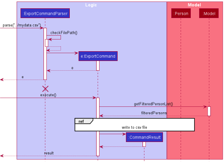
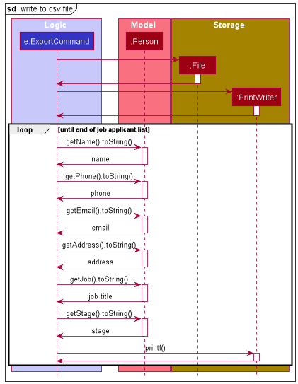
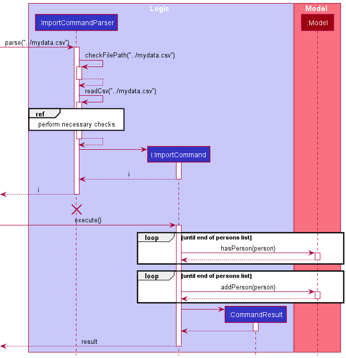
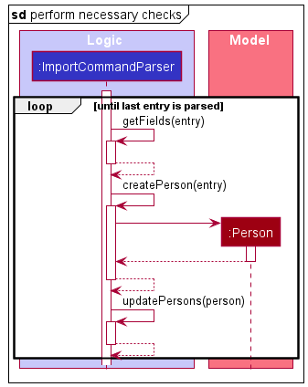
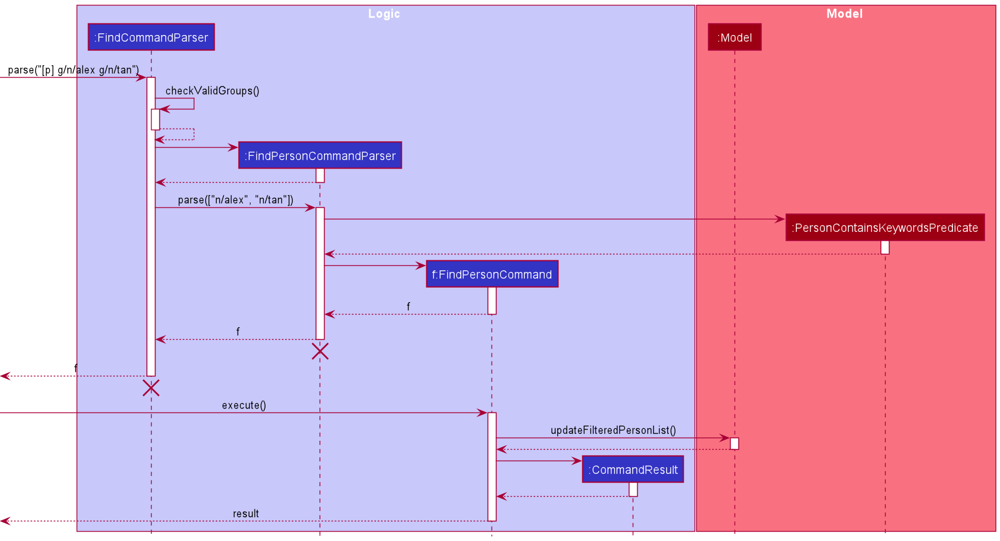

* Table of Contents
{:toc}

--------------------------------------------------------------------------------------------------------------------

## **Acknowledgements**

* {list here sources of all reused/adapted ideas, code, documentation, and third-party libraries -- include links to the original source as well}

--------------------------------------------------------------------------------------------------------------------

## **Setting up, getting started**

Refer to the guide [_Setting up and getting started_](SettingUp.md).

--------------------------------------------------------------------------------------------------------------------

## **Design**

:bulb: **Tip:** The `.puml` files used to create diagrams in this document can be found in the [diagrams](https://github.com/se-edu/addressbook-level3/tree/master/docs/diagrams/) folder. Refer to the [_PlantUML Tutorial_ at se-edu/guides](https://se-education.org/guides/tutorials/plantUml.html) to learn how to create and edit diagrams.

### Architecture

The ***Architecture Diagram*** given above explains the high-level design of the App.

Given below is a quick overview of main components and how they interact with each other.

**Main components of the architecture**

**`Main`** has two classes called [`Main`](https://github.com/se-edu/addressbook-level3/tree/master/src/main/java/seedu/address/Main.java) and [`MainApp`](https://github.com/se-edu/addressbook-level3/tree/master/src/main/java/seedu/address/MainApp.java). It is responsible for,
* At app launch: Initializes the components in the correct sequence, and connects them up with each other.
* At shut down: Shuts down the components and invokes cleanup methods where necessary.

[**`Commons`**](#common-classes) represents a collection of classes used by multiple other components.

The rest of the App consists of four components.

* [**`UI`**](#ui-component): The UI of the App.
* [**`Logic`**](#logic-component): The command executor.
* [**`Model`**](#model-component): Holds the data of the App in memory.
* [**`Storage`**](#storage-component): Reads data from, and writes data to, the hard disk.

**How the architecture components interact with each other**

The *Sequence Diagram* below shows how the components interact with each other for the scenario where the user issues the command `delete 1`.

Each of the four main components (also shown in the diagram above),

* defines its *API* in an `interface` with the same name as the Component.
* implements its functionality using a concrete `{Component Name}Manager` class (which follows the corresponding API `interface` mentioned in the previous point.

For example, the `Logic` component defines its API in the `Logic.java` interface and implements its functionality using the `LogicManager.java` class which follows the `Logic` interface. Other components interact with a given component through its interface rather than the concrete class (reason: to prevent outside component's being coupled to the implementation of a component), as illustrated in the (partial) class diagram below.

The sections below give more details of each component.

### UI component

The **API** of this component is specified in [`Ui.java`](https://github.com/se-edu/addressbook-level3/tree/master/src/main/java/seedu/address/ui/Ui.java)

The UI consists of a `MainWindow` that is made up of parts e.g.`CommandBox`, `ResultDisplay`, `PersonListPanel`, `StatusBarFooter` etc. All these, including the `MainWindow`, inherit from the abstract `UiPart` class which captures the commonalities between classes that represent parts of the visible GUI.

The `UI` component uses the JavaFx UI framework. The layout of these UI parts are defined in matching `.fxml` files that are in the `src/main/resources/view` folder. For example, the layout of the [`MainWindow`](https://github.com/se-edu/addressbook-level3/tree/master/src/main/java/seedu/address/ui/MainWindow.java) is specified in [`MainWindow.fxml`](https://github.com/se-edu/addressbook-level3/tree/master/src/main/resources/view/MainWindow.fxml)

The `UI` component,

* executes user commands using the `Logic` component.
* listens for changes to `Model` data so that the UI can be updated with the modified data.
* keeps a reference to the `Logic` component, because the `UI` relies on the `Logic` to execute commands.
* depends on some classes in the `Model` component, as it displays `Person` object residing in the `Model`.

### Logic component

**API** : [`Logic.java`](https://github.com/se-edu/addressbook-level3/tree/master/src/main/java/seedu/address/logic/Logic.java)

Here's a (partial) class diagram of the `Logic` component:

How the `Logic` component works:
1. When `Logic` is called upon to execute a command, it uses the `AddressBookParser` class to parse the user command.
1. This results in a `Command` object (more precisely, an object of one of its subclasses e.g., `AddCommand`) which is executed by the `LogicManager`.
1. The command can communicate with the `Model` when it is executed (e.g. to add a person).
1. The result of the command execution is encapsulated as a `CommandResult` object which is returned back from `Logic`.

The Sequence Diagram below illustrates the interactions within the `Logic` component for the `execute("delete 1")` API call.

:information_source: **Note:** The lifeline for `DeleteCommandParser` should end at the destroy marker (X) but due to a limitation of PlantUML, the lifeline reaches the end of diagram.

Here are the other classes in `Logic` (omitted from the class diagram above) that are used for parsing a user command:

How the parsing works:
* When called upon to parse a user command, the `AddressBookParser` class creates an `XYZCommandParser` (`XYZ` is a placeholder for the specific command name e.g., `AddCommandParser`) which uses the other classes shown above to parse the user command and create a `XYZCommand` object (e.g., `AddCommand`) which the `AddressBookParser` returns back as a `Command` object.
* All `XYZCommandParser` classes (e.g., `AddCommandParser`, `DeleteCommandParser`, ...) inherit from the `Parser` interface so that they can be treated similarly where possible e.g, during testing.

### Model component
**API** : [`Model.java`](https://github.com/AY2122S2-CS2103T-W11-2/tp/blob/master/src/main/java/seedu/address/model/Model.java)

The `Model` component,

* stores the address book data i.e., all `Person` objects (which are contained in a `UniquePersonList` object).
* stores the currently 'selected' `Person` objects (e.g., results of a search query) as a separate _filtered_ list which is exposed to outsiders as an unmodifiable `ObservableList<Person>` that can be 'observed' e.g. the UI can be bound to this list so that the UI automatically updates when the data in the list change.
* stores the address book data i.e., all `Interview` objects (which are contained in a `UniqueInterviewList` object).
* stores the currently 'selected' `Interview` objects (e.g., results of a search query) as a separate _filtered_ list which is exposed to outsiders as an unmodifiable `ObservableList<Interview>` that can be 'observed' e.g. the UI can be bound to this list so that the UI automatically updates when the data in the list change.
* stores the address book data i.e., all `Task` objects (which are contained in a `UniqueTaskList` object).
* stores the currently 'selected' `Task` objects (e.g., results of a search query) as a separate _filtered_ list which is exposed to outsiders as an unmodifiable `ObservableList<Task>` that can be 'observed' e.g. the UI can be bound to this list so that the UI automatically updates when the data in the list change.
* stores a `UserPref` object that represents the user’s preferences. This is exposed to the outside as a `ReadOnlyUserPref` objects.
* does not depend on any of the other three components (as the `Model` represents data entities of the domain, they should make sense on their own without depending on other components)

:information_source: **Note:** An alternative (arguably, a more OOP) model is given below.  

### Storage component

**API** : [`Storage.java`](https://github.com/AY2122S2-CS2103T-W11-2/tp/blob/master/src/main/java/seedu/address/storage/Storage.java)

The `Storage` component,
* can save both address book data and user preference data in json format, and read them back into corresponding objects.
* inherits from both `AddressBookStorage` and `UserPrefStorage`, which means it can be treated as either one (if only the functionality of only one is needed).
* depends on some classes in the `Model` component (because the `Storage` component's job is to save/retrieve objects that belong to the `Model`)

### Common classes

Classes used by multiple components are in the `seedu.addressbook.commons` package.

--------------------------------------------------------------------------------------------------------------------

## **Implementation**

This section describes some noteworthy details on how certain features are implemented.

### Export Feature

The export feature takes the current address book data stored in memory and exports the job applicants data into a user-specified
csv file that is tab-delimited.

The structure for the csv file is defined as follows:

name | phone_number | email | address | job_title | current_application_progress

An invalid file path is defined as follows:
1. An empty string.
2. A file path containing invalid characters (such as: "<" or ">" for Windows OS)
3. A file path that does not end with `.csv`.

#### Implementation

The export feature is facilitated by the `ExportCommand` while the necessary checks for the export 
feature is facilitated by the `ExportCommandParser`.

&nbsp;

Given below is an example usage scenario and how the export mechanism behaves at each step.

Step 1. User enters `export ../../my_data.csv` into the application.

Step 2. The file path is passed to `ExportCommandParser#parse()` and `ExportCommandParser#checkFilePath()` checks the validity of the file path.

Step 3. After checking that the file path is valid, the data type of the file path is converted from its *string* representation into a *Path* representation.

Step 4. A new `ExportCommand` object is created with the file path as its parameter.

Step 5. The `ExportCommand#execute()` method is called, and it calls `Model#getFilteredPersonList()` to get the current list of job applicants.

Step 6. For each person in the persons list, the *string* representation of each field is obtained and concatenated into
the aformentioned format above, then it is written into the user-specified csv file.

Step 7. A new `CommandResult` object is returned signifying that the command has executed successfully.

&nbsp;

The following sequence diagram summarises how the export operation works.

  

  

### Import Feature

The import feature takes in a csv file and adds all the job applicants stored in the csv file back into the application.

The csv file structure needs to follow the file structure as defined by the [export feature](#export-feature).

An invalid csv file path also follows the conditions as defined by the [export feature](#export-feature).

#### Implementation

The import feature is facilitated by the `ImportCommand` while the necessary checks for the import feature is facilitated by the `ImportCommandParser`.

&nbsp;

Given below is an example usage scenario and how the import mechanism behaves at each step.

Step 1. User enters `import ../../past_data.csv` into the application.

Step 2. The file path is passed to `ImportCommandParser#parse()` and `ImportCommandParser#checkFilePath()` checks the validity of the file path.

Step 3. After checking that the file path is valid, the data type of the file path is converted from its *string* representation into a *Path* representation.

Step 4. The `ImportCommandParser#readCsv()` is called to parse the csv file. From there, 3 methods are called to ensure the correctness of the csv file. 
 * `ImportCommandParser#getFields()`: ensures that the number of fields in each line matches the number of fields required by the application
 * `ImportCommandParser#createPerson()`: ensures that each field is valid and correct and converts the line into a person object.
 * `ImportCommandParser#updatePersons()`: ensures that each person in the csv file is unique with regards to the csv file.

Step 5. The newly created person is added to a temporary list.

Step 6. A new `ImportCommand` object is created with the aforementioned temporary list as its parameter.

Step 7. The `ImportCommand#execute()` method is called. It checks that there are no persons in the temporary list that already exists in the current application before adding each person into the current application.

Step 8. A new `CommandResult` object is returned signifying that the command has executed successfully.

&nbsp;

The following sequence diagram summarises how the import operation works.

  

  

### Find Feature

The find feature finds all data within a specified component (Person/Interview/Task) such that it matches the search criteria.

#### Implementation

The find feature is facilitated by the subclasses of the `FindCommand` while the necessary checks for the find feature is facilitated by the subclasses of `FindCommandParser`. The actual checking is faciliated by the `{Component Name}ContainsKeywordsPredicate`

&nbsp;

Given below is an example usage scenario and how the find mechanism behaves at each step.

Step 1. User enters `find [p] g/n/alex g/n/tan` into the application.

Step 2. The search criteria is passed to `ImportCommandParser#parse()` and its component is determined.

Step 3. Next, the search criteria is checked for any invalid groups.

Step 4. The list of groups are then passed into `FindPersonCommandParser#parse()` to check for any invalid flags or formats.

Step 5. A new `PersonContainsKeywordsPredicate` predicate object is created using the list of groups as its parameter.

&nbsp;

The following sequence diagram summarises how the find operation works

  

#### Design Considerations

* **Alternative 1:** Using AND, OR, NOT operators (i.e. `find john AND tom OR (gmail.com AND NOT 111)`).
  * Pros: More intuitive to the technically inclined and more control over the search results.
  * Cons: Harder to parse and implement.
* **Alternative 2** Using free text queries (i.e. `find john tom gmail.com`)
  * Pros: More intuitive as user expects queried person to contain all the search terms.
  * Cons: Lacks the flexibility provided by AND and OR operators.

--------------------------------------------------------------------------------------------------------------------

## **Documentation, logging, testing, configuration, dev-ops**

* [Documentation guide](Documentation.md)
* [Testing guide](Testing.md)
* [Logging guide](Logging.md)
* [Configuration guide](Configuration.md)
* [DevOps guide](DevOps.md)

--------------------------------------------------------------------------------------------------------------------

## **Appendix: Requirements**

### Product scope

**Target user profile**: Tech HR Recruiters

* Required to manage a significant number of contacts.
* Prefer desktop apps over other types.
* Proficient typists.
* Prefers typing to mouse interactions. 
* Reasonably comfortable using CLI apps.

**Value proposition**:
* Manage contacts more efficiently using CLI as compared to a typical mouse/GUI driven app.
* Find applicants based on their details, e.g. name, position applied, stage of application.
* Archive/Retrieve applicants' details for long term storage/ easy transfer of data into address book.
* Keep track of applicant's upcoming and past interviews.
* A task list to keep track of miscellaneous information.

### User stories

Priorities: High (must have) - `* * *`, Medium (nice to have) - `* *`, Low (unlikely to have) - `*`

| Priority | As a …​           | I want to …​                                     | So that I can…​                                        |
|----------|-------------------|--------------------------------------------------|--------------------------------------------------------|
| `* * *`  | Tech HR Recruiter | add applicants to my address book                | record their details                                   |
| `* * *`  | Tech HR Recruiter | take note of scheduled interviews for applicants | keep track of their interview dates                    |
| `* * *`  | Tech HR Recruiter | record miscellaneous information                 | keep track of any important details                    |
| `* * *`  | Tech HR Recruiter | view the details of all contacts                 | see all my contacts at a glance                        |
| `* * *`  | Tech HR Recruiter | view all scheduled interviews                    | see all upcoming and past interviews                   |
| `* * *`  | Tech HR Recruiter | view all recorded miscellaneous information      | see all important information at a glance              |
| `* * *`  | Tech HR Recruiter | remove any applicant from my contact list        | delete any applicant that is no longer of interest     |
| `* * *`  | Tech HR Recruiter | remove a scheduled interview                     | delete any interview that is cancelled                 |
| `* * *`  | Tech HR Recruiter | remove any recorded information                  | delete tasks/information off my task list              |
| `* * *`  | tech HR recruiter | update any applicant's details                   | edit any mistakes in the applicant's detail            |
| `* * *`  | tech HR recruiter | update the details of a scheduled interview      | edit any mistakes in the scheduled interview           |
| `* * *`  | tech HR recruiter | update any task/information details              | edit any mistakes in the miscellaneous information     |
| `* * *`  | tech HR recruiter | find an applicant in my address book             | locate them easily                                     |
| `* * *`  | tech HR recruiter | find a scheduled interview                       | locate a specific interview                            |
| `* * *`  | tech HR recruiter | find specific information I recorded             | locate details and information quickly                 |
| `* * *`  | tech HR recruiter | clear all applicants from my addressbook         | easily empty my address book                           |
| `* * *`  | tech HR recruiter | clear all schedule interviews                    | easily remove all schedule interviews                  |
| `* * *`  | tech HR recruiter | clear all recorded miscellaneous information     | easily remove all recorded information                 |
| `* *`    | tech HR recruiter | export details of all applicants                 | archive the data for future reference                  |
| `* *`    | tech HR recruiter | import details of applicants                     | easily transfer applicant details into my address book |

### Use cases
For all use cases below, the **System** is the `HRConnect` and the **Actor** is the `Tech HR Recruiter`, unless specified otherwise.

**Use case: UC1 - Add an applicant**

**MSS**

1. User requests to add an applicant in the address book.
2. HRConnect adds the applicant to person list.

    Use case ends.

**Extensions**

* 1a. The type provided is invalid.

  * 1a1. HRConnect requests for the correct type.
  * 1a2. User enters new type.  
  Steps 1a1-1a2 are repeated until the data entered are correct.  
  Use case resumes from step 2.   

* 1b. The details for some field(s) provided are invalid.

    * 1b1. HRConnect requests for valid details.
    * 1b2. User enters new details for field(s).  
      Steps 1b1-1b2 are repeated until the data entered are correct.  
      Use case resumes from step 2.   

**Use case: UC2 - Add an interview**

**MSS**

1. User requests to add an interview to the interview list.
2. HRConnect adds the interview to interview list.

   Use case ends.

**Extensions**

* 1a. The type is invalid.

    * 1a1. HRConnect requests for the correct type.
    * 1a2. User enters new type.  
      Steps 1a1-1a2 are repeated until the data entered are correct.  
      Use case resumes from step 2.   

* 1b. The INDEX is out of bounds.

    * 1b1. HRConnect requests for a valid INDEX.
    * 1b2. User enters new INDEX.  
      Steps 1b1-1b2 are repeated until the INDEX entered is valid.  
      Use case resumes from step 2.   
    
**Use case: UC3 - Add a task**

**MSS**

1. User requests to add a task to the task list.
2. HRConnect adds the task to task list.

   Use case ends.

**Extensions**

* 1a. The type is invalid.

    * 1a1. HRConnect requests for the correct type.
    * 1a2. User enters new type.  
      Steps 1a1-1a2 are repeated until the data entered are correct.  
      Use case resumes from step 2.   

* 1b. The details for some field(s) provided are invalid.

    * 1b1. HRConnect requests for valid details.
    * 1b2. User enters new details for field(s).  
      Steps 1b1-1b2 are repeated until the data entered are correct.  
      Use case resumes from step 2.   

**Use case: UC4 - Delete an applicant**

**MSS**

1. User requests to delete an applicant from the address book.
2. HRConnect deletes the applicant from the person list.

   Use case ends.

**Extensions**

* 1a. The type is invalid.

    * 1a1. HRConnect requests for the correct type.
    * 1a2. User enters new type.  
      Steps 1a1-1a2 are repeated until the data entered are correct.  
      Use case resumes from step 2.   

* 1b. The INDEX is out of bounds.

    * 1b1. HRConnect requests for a valid INDEX.
    * 1b2. User enters new INDEX.  
      Steps 1b1-1b2 are repeated until the INDEX entered is valid.  
      Use case resumes from step 2.   
  
* 1c. The given applicant has an interview.

    * 1c1. HRConnect requests for the user to delete the interview.
    * 1c2. User deletes interview.  
    Steps 1c1-1c2 are repeated until the correct interview has been deleted.  
    Use case resumes from step 2.  

**Use case: UC5 - Delete an interview**

**MSS**

1. User requests to delete a interview in the address book.
2. AddressBook deletes the interview from the interview list.

   Use case ends.

**Extensions**

* 1a. The type is invalid.

    * 1a1. HRConnect requests for the correct type.
    * 1a2. User enters new type.  
      Steps 1a1-1a2 are repeated until the data entered are correct.  
      Use case resumes from step 2.   

* 1b. The INDEX is out of bounds.

    * 1b1. HRConnect requests for a valid INDEX.
    * 1b2. User enters new INDEX.  
      Steps 1b1-1b2 are repeated until the INDEX entered is valid.  
      Use case resumes from step 2.   

**Use case: UC6 - Delete a task**

**MSS**

1. User requests to delete a task from the task list.
2. HRConnect deletes the task from the task list.

   Use case ends.

**Extensions**

* 1a. The type is invalid.

    * 1a1. HRConnect requests for the correct type.
    * 1a2. User enters new type.  
      Steps 1a1-1a2 are repeated until the data entered are correct.  
      Use case resumes from step 2.   

* 1b. The INDEX is out of bounds.

    * 1b1. HRConnect requests for a valid INDEX.
    * 1b2. User enters new INDEX.  
      Steps 1b1-1b2 are repeated until the INDEX entered is valid.  
      Use case resumes from step 2.   

**Use case: UC7 - List applicant list**

**MSS**

1. User requests to list all people in the address book.
2. HRConnect displays list of applicants.

   Use case ends.

**Extensions**

* 1a. The type is invalid.

    * 1a1. HRConnect requests for the correct type.
    * 1a2. User enters new type.  
      Steps 1a1-1a2 are repeated until the data entered are correct.  
      Use case resumes from step 2.   

**Use case: UC8 - List interview list**

**MSS**

1. User requests to see all scheduled interviews in the address book.
2. HRConnect displays interview list.

   Use case ends.

**Extensions**

* 1a. The type is invalid.

    * 1a1. HRConnect requests for the correct type.
    * 1a2. User enters new type.  
      Steps 1a1-1a2 are repeated until the data entered are correct.  
      Use case resumes from step 2.   

**Use case: UC9 - List task list**

**MSS**

1. User requests to see all tasks in the address book.
2. HRConnect displays task list.

   Use case ends.

**Extensions**

* 1a. The type is invalid.

    * 1a1. HRConnect requests for the correct type.
    * 1a2. User enters new type.  
      Steps 1a1-1a2 are repeated until the data entered are correct.  
      Use case resumes from step 2.   

**Use case: UC10 - Clear applicant list**

**MSS**

1. User requests to clear all applicants in the address book.
2. HRConnect clears all applicants.

   Use case ends.

**Extensions**

* 1a. The type is invalid.

    * 1a1. HRConnect requests for the correct type.
    * 1a2. User enters new type.  
      Steps 1a1-1a2 are repeated until the data entered are correct.  
      Use case resumes from step 2.   

**Use case: UC11 - Clear interview list**

**MSS**

1. User requests to clear all scheduled interviews in the address book.
2. HRConnect clears all interviews from interview list.

   Use case ends.

**Extensions**

* 1a. The type is invalid.

    * 1a1. HRConnect requests for the correct type.
    * 1a2. User enters new type.  
      Steps 1a1-1a2 are repeated until the data entered are correct.  
      Use case resumes from step 2.   

**Use case: UC12 - Clear task list**

**MSS**

1. User requests to clear all tasks from the task list.
2. HRConnect clears task list.

   Use case ends.

**Extensions**

* 1a. The type is invalid.

    * 1a1. HRConnect requests for the correct type.
    * 1a2. User enters new type.  
      Steps 1a1-1a2 are repeated until the data entered are correct.  
      Use case resumes from step 2.   

**Use case: UC13 - Edit an applicant's particulars**

**MSS**

1.  User requests to update a specific applicants' details.
2.  HRConnect shows applicant with their updated details.

    Use case ends.

**Extensions**

* 1a. The type is invalid.

    * 1a1. HRConnect requests for the correct type.
    * 1a2. User enters new type.  
      Steps 1a1-1a2 are repeated until the data entered are correct.  
      Use case resumes from step 2.   

* 1b. The details for some field(s) provided are invalid.

    * 1b1. HRConnect requests for valid details.
    * 1b2. User enters new details for field(s).  
      Steps 1b1-1b2 are repeated until the data entered are correct.  
      Use case resumes from step 2.   

**Use case: UC14 - Edit an interview**

**MSS**

1.  User requests to update a specific interview.
2.  HRConnect shows interview with it's updated details

    Use case ends.

**Extensions**

* 1a. The type is invalid.

    * 1a1. HRConnect requests for the correct type.
    * 1a2. User enters new type.  
      Steps 1a1-1a2 are repeated until the data entered are correct.  
      Use case resumes from step 2.   

* 1b. The details for some field(s) provided are invalid.

    * 1b1. HRConnect requests for valid details.
    * 1b2. User enters new details for field(s).  
      Steps 1b1-1b2 are repeated until the data entered are correct.  
      Use case resumes from step 2.   

**Use case: UC15 - Edit a task**

**MSS**

1.  User requests to update a specific task.
2.  HRConnect shows task with it's updated details

    Use case ends.

**Extensions**

* 1a. The type is invalid.

    * 1a1. HRConnect requests for the correct type.
    * 1a2. User enters new type.  
      Steps 1a1-1a2 are repeated until the data entered are correct.  
      Use case resumes from step 2.   

* 1b. The details for some field(s) provided are invalid.

    * 1b1. HRConnect requests for valid details.
    * 1b2. User enters new details for field(s).  
      Steps 1b1-1b2 are repeated until the data entered are correct.  
      Use case resumes from step 2.   

**Use case: UC16 - Find an applicant**

**MSS**

1.  User requests to find a specific applicant.
2.  HRConnect shows applicant with the specified details.

    Use case ends.

**Extensions**

* 1a. The type is invalid.

    * 1a1. HRConnect requests for the correct type.
    * 1a2. User enters new type.  
      Steps 1a1-1a2 are repeated until the data entered are correct.  
      Use case resumes from step 2.   

* 1b. The details for some field(s) provided are invalid.

    * 1b1. HRConnect requests for valid details.
    * 1b2. User enters new details for field(s).  
      Steps 1b1-1b2 are repeated until the data entered are correct.  
      Use case resumes from step 2.   

**Use case: UC17 - Find a scheduled interview**

**MSS**

1.  User requests to find a specific interview.
2.  HRConnect shows interview with the specified details

    Use case ends.

**Extensions**

* 1a. The type is invalid.

    * 1a1. HRConnect requests for the correct type.
    * 1a2. User enters new type.  
      Steps 1a1-1a2 are repeated until the data entered are correct.  
      Use case resumes from step 2.   

* 1b. The details for some field(s) provided are invalid.

    * 1b1. HRConnect requests for valid details.
    * 1b2. User enters new details for field(s).  
      Steps 1b1-1b2 are repeated until the data entered are correct.  
      Use case resumes from step 2.   

**Use case: UC18 - Find a task**

**MSS**

1.  User requests to find a specific task.
2.  HRConnect shows task with the specified details

    Use case ends.

**Extensions**

* 1a. The type is invalid.

    * 1a1. HRConnect requests for the correct type.
    * 1a2. User enters new type.  
      Steps 1a1-1a2 are repeated until the data entered are correct.  
      Use case resumes from step 2.   

* 1b. The details for some field(s) provided are invalid.

    * 1b1. HRConnect requests for valid details.
    * 1b2. User enters new details for field(s).  
      Steps 1b1-1b2 are repeated until the data entered are correct.  
      Use case resumes from step 2.   

**Use case: UC19 - Export data from address book**

**MSS**

1.  User requests to export data.
2.  HRConnect exports data to specified csv file.

    Use case ends.

**Extensions**

* 1a. The filepath to csv file is invalid.

    * 1a1. HRConnect requests for the valid filepath.
    * 1a2. User enters new filepath.  
      Steps 1a1-1a2 are repeated until the filepath entered is valid.  
      Use case resumes from step 2.   

* 1b. The filename is missing a .csv file extension.

    * 1b1. HRConnect requests for a valid filename with the correct file extension.
    * 1b2. User enters new filename.  
      Steps 1b1-1b2 are repeated until the filename entered is valid.  
      Use case resumes from step 2.   

**Use case: UC20 - Import data to address book**

**MSS**

1.  User requests to import data.
2.  HRConnect shows all applicants imported into the address book. 

    Use case ends.

**Extensions**

* 1a. The filepath is invalid.

    * 1a1. HRConnect requests for the valid filepath.
    * 1a2. User enters new filepath.  
      Steps 1a1-1a2 are repeated until the filepath entered is valid.  
      Use case resumes from step 2.   
  
* 1b. Duplicate applicant found in address book

    * 1a1. HRConnect alerts user that applicant is already in address book and aborts the import.
    * 1b1. User deletes applicant from address book. (UC4)  
      Use case resumes from step 1.   

### Non-Functional Requirements

1. Should work on any _mainstream OS_ as long as it has Java `11` or above installed.
2. Should be able to hold up to 1000 persons without a noticeable sluggishness in performance for typical usage.
3. A user with above average typing speed for regular English text (i.e. not code, not system admin commands) should be able to accomplish most of the tasks faster using commands than using the mouse.
4. Should only be used by Tech HR Recruiters.

*{More to be added}*

### Glossary

* **Mainstream OS**: Windows, Linux, Unix, OS-X

* **Private contact detail**: A contact detail that is not meant to be shared with others

* **Tech HR Recruiters**: a Human Resource specialist that assists in the proper staffing of technical positions within an organization

--------------------------------------------------------------------------------------------------------------------

## **Appendix: Instructions for manual testing**

Given below are instructions to test the app manually.

:information_source: **Note:** These instructions only provide a starting point for testers to work on;
testers are expected to do more *exploratory* testing.

### Launch and shutdown

1. Initial launch

   1. Download the jar file and copy into an empty folder

   1. Double-click the jar file Expected: Shows the GUI with a set of sample contacts. The window size may not be optimum.

1. Saving window preferences

   1. Resize the window to an optimum size. Move the window to a different location. Close the window.

   1. Re-launch the app by double-clicking the jar file. 
       Expected: The most recent window size and location is retained.

### Adding a Task

### Editing an Interview

### Deleting a Job Applicant

// test for if got interviews 

### Clearing all Job Applicants

// test for if got interviews 

### Finding a Job Applicant

// THIS BOTTOM ARE JUST EXAMPLES

### Deleting a person

1. Deleting a person while all persons are being shown

   1. Prerequisites: List all persons using the `list` command. Multiple persons in the list.

   1. Test case: `delete 1` 
      Expected: First contact is deleted from the list. Details of the deleted contact shown in the status message. Timestamp in the status bar is updated.

   1. Test case: `delete 0` 
      Expected: No person is deleted. Error details shown in the status message. Status bar remains the same.

   1. Other incorrect delete commands to try: `delete`, `delete x`, `...` (where x is larger than the list size) 
      Expected: Similar to previous.
  
   1. Test case: `delete Jeremy` 
      Expected: Person with name "Jeremy" is deleted. If name does not exist in the database, error is thrown. 
      Error details shown in the status message. 
 
1. _{ more test cases …​ }_

### Saving data

1. Dealing with missing/corrupted data files

   1. _{explain how to simulate a missing/corrupted file, and the expected behavior}_

1. _{ more test cases …​ }_
