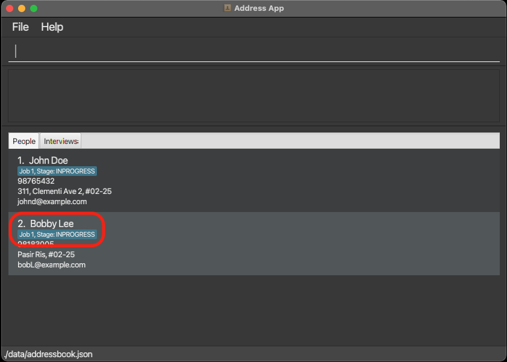
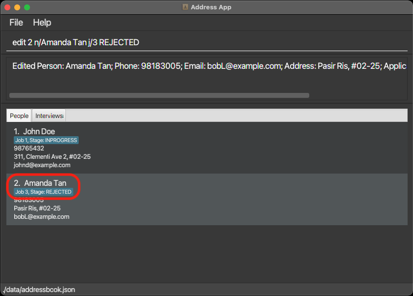
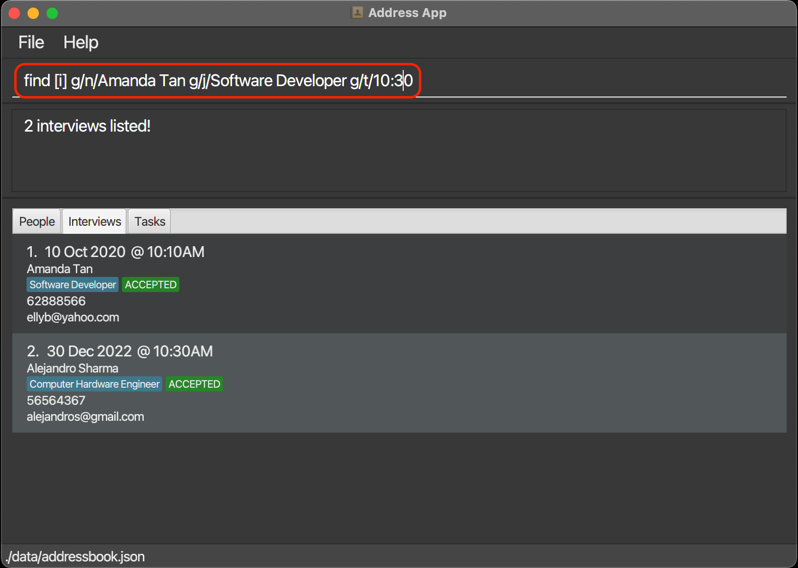

HRConnect is a desktop application for managing the contacts of job applicants. It can also be used to keep track of 
the progress of each applicant during the application process.

* Table of Contents
{:toc}

## Quick Start
1. Ensure you have `Java 11` or above installed in your computer.
2. Download the latest `HRConnect.jar` from <a href="https://github.com/AY2122S2-CS2103T-W11-2/tp/releases">here</a>
3. Copy the file to the folder you want to use as the *home folder* for your HRConnect.
4. Double-click the file to start the app. The GUI similar to the below should appear in a few seconds. Note how the app contains some sample data.
   
  

5. Type your command into the command box and press `Enter` to execute it. 

    Some sample commands to try:
   * `add [p] n/Bob Tan p/98765876 e/bot@gmail.com a/262 Serangoon Central Drive 1-125 
   j/Software Developer s/INPROGRESS`: Adds a new contact name Bob Tan to the address book
   * `list [p]`: Lists all contacts
   * `delete [p] 1`: Deletes job applicant index **1** from the address book
   * `clear [p]`: Deletes all applicants.
   * `exit`: Exits the app.

6. Refer to _Features_ section directly below for details on each command.

## Features

**:information_source: Notes about the command format regarding Applicants:** 

* Items in angle brackets are optional. 
  e.g n/NAME <p/PHONE_NUMBER> can be used as n/John Doe p/PHONE_NUMBER or as n/John Doe.

* Words in `UPPER_CASE` are the parameters to be supplied by the user. 
  e.g. in add n/NAME, NAME is a parameter which can be used as add n/John Doe.

* Items with elipsis (...) after them can be used multiple times including zero times. 
  e.g. <a/ADDRESS>... can be used as   (i.e. 0 times), a/ADDRESS, a/ADDRESS etc.

* Parameters can be supplied in any order. 
  e.g. if the command requires n/NAME p/PHONE_NUMBER,   p/PHONE_NUMBER n/NAME is also acceptable.

* If a parameter is expected only once in the command but you specified it multiple times, only the last occurrence of the parameter will be taken. 
  e.g. if you specify p/12341234 p/56785678, only p/56785678 will be taken.

* Extraneous parameters for commands that do not take in parameters (such as help, list, exit and clear) will be ignored. 
  e.g. if the command specifies `help 123`, it will be interpreted as `help`.

&nbsp;

## General Features
### Viewing Help: `help`
Shows a message explaining how to access the help page and the basic flags.

Format: `help`  
&nbsp;
### Exiting the program: `exit`
Exits the program.

Format: `exit`

## Applicant Features
### Adding a new job applicant: `add [p]` 
Adds a new job applicant to the address book.

  Format: `add [p] n/NAME p/PHONE_NUMBER e/EMAIL a/ADDRESS j/JOB_POSITION s/STAGE`

  Example: 
  `add [p] n/John Doe p/98765432 e/johnd@example.com a/311, Clementi Ave 2, #02-25 j/Software Developer s/INPROGRESS`

&nbsp;
### Editing a job applicant:`edit [p]`
Edits an existing job applicant in the address book

  Format: `edit [p] INDEX <n/NAME> <p/PHONE_NUMBER> <e/EMAIL> <a/ADDRESS> <j/JOB_POSITION> <s/STAGE>`   
  
  Example: 
  `edit [p] 2 n/Amanda Tan j/Software Developer s/REJECTED`   

Before edit command executed. 
   

After edit command is executed.  
   

:exclamation: **Take note:** Cannot edit a person if he/she has an interview scheduled.

&nbsp;
### Deleting job applicant: `delete [p]` 
Deletes an existing job applicant from the address book.

:exclamation: **Take note:** Cannot delete a person if he/she has an interview scheduled.

Format: `delete [p] INDEX`

Example: 
`delete [p] 1`   

&nbsp;
### Listing all job applicants: `list [p]`
Shows a list of all job applicants in the address book.

Format:`list [p]`

&nbsp;
### Clearing all job applicants: `clear [p]`
Clears all job applicants from the address book.

Format: `clear [p]`

&nbsp;
### Finding job applicant(s) by keywords: `find [p]` 
Finds job applicants whose data contain the given keywords.

Use `g/` flags to find job applicants whose data contain **all** the keywords.

:bulb: Tip: Use multiple `g/` flags as an **OR** command (e.g. `find [p] g/n/alex g/j/software developer g/s/INPROGRESS`)

Notes:
* Finding persons `[p]` **only** accepts `g/`, `n/`, `p/`, `e/`, `a/`, `j/`, and `s/` flags
* If a keyword without a flag is used, an error will be raised.
* Keywords are still required to follow the format defined as by the flags.

Format: `find [p] g/KEYWORD <KEYWORDS>... <g/KEYWORD <KEYWORDS>...>...`

Examples: 
* `find [p] g/s/ACCEPTED g/n/John Doe` is logically equivalent to  
`find [p] s/ACCEPTED OR n/John Doe`     
    

* `find [p] g/j/Software Developer s/ACCEPTED` is logically equivalent to   
`find [p] j/Software Developer AND s/ACCEPTED`    

* `find [p] g/j/Software Developer s/REJECTED g/n/John Doe` is logically equivalent to  
`find [p] (j/Software Developer AND s/REJECTED) OR n/John Doe`    

&nbsp;

## Interview Features
### :information_source: Notes about the command format regarding Interviews:

&nbsp;
### Adding a new interview slot for a job applicant: `add [i]`
Adds a new job interview slot to the address book.

  Format: `add [i] INDEX d/DATE t/TIME`   

  * `INDEX` in this context refers to the numerical position of the `Applicant` in the job applicant list, under
  the `People` tab.  

  Example: 
  `add [i] 1 d/2021-06-25 t/17:30`

&nbsp;
### Editing an existing interview slot: `edit [i]`
Edits an existing interview slot in the address book

  Format: `edit [i] INDEX <d/DATE> <t/TIME>`   
  
  * `INDEX` in this context refers to the numerical position of the `Interview` in the interview list, under
  the `Interviews` tab.  

  Examples:
    `edit [i] 1 d/2021-12-30`  
  `edit [i] 1 t/10:30`  
  `edit [i] 1 d/2021-12-30 t/10:30`   

&nbsp;
### Deleting an interview slot: `delete [i]`
Deletes an existing interview slot in the address book.

  Format: `delete [i] INDEX`

  Example: 
  `delete [i] 1`

&nbsp;
### Listing all scheduled interviews: `list [i]`
Shows a list of all scheduled interviews in the address book.

Format: `list [i]`

&nbsp;
### Clearing all interviews: `clear [i]`
Clears all interviews from the address book.

Format: `clear [i]`

&nbsp;
### Finding scheduled interview slot(s) by keywords: `find [i]`
Finds interview slots with data containing any of the specified keywords.

Use `g/` flags to find interview slot(s) with data containing **all** the keywords.

:bulb: Hint: Use multiple `g/` flags to simulate an **OR** command (e.g. `find [i] g/n/alex g/j/software developer g/s/INPROGRESS`)

Notes:
* Finding interviews `[i]` **only** accepts `g/`, `n/`, `d/`, `t/`, and `j/`, flags.
* If a keyword without a flag is used, an error will be raised.
* Keywords are still required to follow the format defined as by the flags.

Format: `find [i] g/KEYWORD <KEYWORDS>... <g/KEYWORD <KEYWORDS>...>...`

Examples: 
* `find [i] g/n/Amanda Tan g/j/Software Developer g/t/10:10` is logically equivalent to `find [i] n/Amanda Tan OR j/Software Developer OR t/10:10`   
* `find [i] g/n/Amanda Tan j/Software Developer t/10:10` is logically equivalent to `find [i] n/Amanda Tan AND j/Software Developer AND t/10:10`   
* `find [i] g/n/Amanda Tan j/Software Developer g/t/10:10` is logically equivalent to `find [i] (n/Amanda Tan AND g/j/Software Developer) OR t/10:10`   

## Task Features
### :information_source: Notes about the command format regarding Tasks:

&nbsp;
### Adding a new task to the miscellaneous task list: `add [t]`
Adds a new task to the address book.

* #### Adding a new task
  Format: `add [t] h/HEADER d/DATE t/TIME i/INFORMATION`   

  Example: 
  `add [i] h/Add interview slots  d/2022-04-01 t/17:30 i/Add all interviews happening in the following week`

[Upcoming Image]

&nbsp;
### Editing an existing task: `edit [t]`
Edits an existing task in the address book

* #### Editing task details
  Format: `edit [t] INDEX <h/HEADER> <d/DATE> <t/TIME> <i/INFORMATION>`  

  Examples: 
    `edit [t] 1 d/2021-12-30`  
  `edit [t] 1 d/2021-12-30 t/10:30`   

[Upcoming Image]

&nbsp;
### Deleting a task: `delete [t]`
Deletes an existing task in the address book.

  Format: `delete [t] INDEX`

  Example: 
  `delete [t] 1`

&nbsp;
### Listing all tasks: `list [t]`
Shows a list of all tasks in the address book.

Format: `list [t]`

&nbsp;
### Clearing all tasks: `clear [t]`
Clears all tasks from the address book.

Format: `clear [t]`

&nbsp;
### Finding task(s) by keywords: `find [t]`
Find tasks with data containing any of the specified keywords.

Use `g/` flags to find task(s) with data containing **all** the keywords.

:bulb: Hint: Use multiple `g/` flags to simulate an **OR** command (e.g. `find [t] g/h/update t/10:10`)

Notes:
* Finding tasks `[t]` **only** accepts `g/`,`h/`, `d/`, `t/`, and `i/` flags
* If a keyword without a flag is used, an error will be raised.
* Keywords are still required to follow the format defined as by the flags.

Format: `find [t] g/KEYWORD <KEYWORDS>... <g/KEYWORD <KEYWORDS>...>...`

Examples: 
* `find [t] g/d/2022-03-04 g/h/update g/t/10:10` is logically equivalent to `find d/2022-03-04 OR h/update OR t/10:10`   
* `find [t] g/d/2022-03-04 h/update t/10:10` is logically equivalent to `find d/2022-03-04 AND h/update AND t/10:10`   
* `find [t] g/d/2022-03-04 h/update g/t/10:10` is logically equivalent to `find (d/2022-03-04 AND h/update) OR t/10:10`   

[Upcoming Image]

&nbsp;
## Storage
### Saving the data
AddressBook data are saved in the hard disk automatically after any command that changes the data. There is no need to save manually.

&nbsp;
### Editing the data file
AddressBook data are saved as a JSON file `PATH_TO_JAR_FILE/data/addressbook.json`. Advanced users are welcome to update data directly by editing that data file.

:exclamation: **Caution:** If your changes to the data file makes its format invalid, the address book will discard all data and start with an empty data file at the next run.

&nbsp;
### Importing the data file: `import`

Imports all **job applicants** data from a *csv* save file generated from this address book.

File Format:
* CSV (tab delimited): name    phone_number    email_address    address    job_description    application_stage

Notes:
1. Filepath can be relative or absolute.
2. No duplicates are allowed to be imported into the address book.
   1. Data in the address book has a higher priority than data in the save file.
3. Save files needs to end with `.csv` in order for the address book to recognise the save file. 
4. If any error is found, **none** of the data in the save file will be imported into the address book.

Format: `import FILEPATH`

Example: `import C:\Users\YOUR_USERNAME\Desktop\data.csv`

&nbsp;
### Exporting to a csv data file: `export`

Exports all **job applicants** data from the address book into a *csv* save file.

File Format:
* CSV (tab delimited): name    phone_number    email_address    address    job_description    application_stage

Notes:
1. Filepath of specified CSV file can be relative or absolute.
2. File name of csv file **cannot** contain any front or back slashes.
   1. Invalid csv file name with front slash: myCSVfile\\.csv
   2. Invalid csv file name with back slash: myCSVfile/.csv
3. Specifying the same csv file name and path will overwrite the data inside the specified csv file.
4. Csv file **must** have .csv as a file extension. 
5. If any error is found while executing the command, 
**none** of the data from the addressbook will be exported into the specified csv file.

Format: `export FILEPATH`

Absolute filepath example for WindowsOS: `export C:\Users\YOUR_USERNAME\Desktop\myData.csv`  
Relative filepath example for WindowsOS: `export ./myData.csv`   
Absolute filepath example for MacOS: `export  /Users/YOUR_USERNAME/Downloads/myDataFile.csv`  
Relative filepath example for MacOS: `export  ./myDataFile.csv
`

## Command Summary

|               Action | Format                                                                                      |
|---------------------:|:--------------------------------------------------------------------------------------------|
|        Add Interview | `add [i] 1 d/DATE t/TIME`                                                                   |
|    Add Job Applicant | `add [p] n/NAME p/PHONE_NUMBER e/EMAIL a/ADDRESS j/JOB_POSITION s/STAGE`                    |
|             Add Task | `add [t] h/HEADER d/DATE t/TIME i/INFORMATION`                                              |
|     Clear Interviews | `clear [i]`                                                                                 |
| Clear Job Applicants | `clear [p]`                                                                                 |
|          Clear Tasks | `clear [t]`                                                                                 |
|     Delete Interview | `delete [i] INDEX`                                                                          |
| Delete Job Applicant | `delete [p] INDEX`                                                                          |
|          Delete Task | `delete [t] INDEX`                                                                          |
|       Edit Interview | `edit [i] INDEX <d/DATE> <t/TIME>`                                                          |
|   Edit Job Applicant | `edit [p] INDEX <n/NAME> <p/PHONE_NUMBER> <e/EMAIL> <a/ADDRESS> <j/JOB_POSITION> <s/STAGE>` |
|            Edit Task | `edit [t] INDEX <h/HEADER> <d/DATE> <t/TIME> <i/INFORMATION>`                               |
|                 Exit | `exit`                                                                                      |
|       Find Interview | `find [i] g/KEYWORD <KEYWORDS>... <g/KEYWORD <KEYWORDS>...>...`                             |
|   Find Job Applicant | `find [p] g/KEYWORD <KEYWORDS>... <g/KEYWORD <KEYWORDS>...>...`                             |
|            Find Task | `find [t] g/KEYWORD <KEYWORDS>... <g/KEYWORD <KEYWORDS>...>...`                             |
|                 Help | `help`                                                                                      |
|      List Interviews | `list [i]`                                                                                  |
|  List Job Applicants | `list [p]`                                                                                  |
|           List Tasks | `list [t]`                                                                                  |
|               Import | `import FILEPATH`                                                                           |
|               Export | `export FILEPATH`                                                                           |
|                 Help | `help`                                                                                      |
|                 Exit | `exit`                                                                                      |
