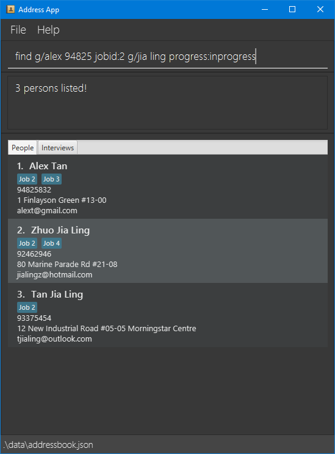

# HRConnect

HRConnect is a desktop application for managing the contacts of job applicants. It can also be used to keep track of 
the progress of each applicant during the application process.

### Table of Contents
* [Quick Start](#Quick-Start)
* [Features](#Features)
  * [Help](#viewing-help-help)
  * [List](#listing-all-job-applicants-list)
  * [Add](#adding-a-new-job-applicantinterview-add)
  * [Edit](#editing-a-job-applicantinterview-edit)
  * [Delete](#deleting-job-applicantinterview-delete)
  * [Find](#finding-a-job-applicant-by-keywords-find)
  * [Clear](#clearing-all-entries-clear)
  * [Exit](#exiting-the-program-exit)
* [Storage](#Storage)
  * [Saving the data](#saving-the-data)
  * [Editing the data file](#editing-the-data-file)
  * [Archive](#archiving-the-current-data-coming-in-v13)
  * [Import](#importing-the-data-file-coming-in-v13)
* [FAQ](#FAQ)
* [Command Summary](#Command-Summary)

## Quick Start
1. Ensure you have `Java 11` or above installed in your computer.
2. Download the latest `addressbook.jar` from 
3. Copy the file to the folder you want to use as the *home folder* for your AddressBook.
4. Double-click the file to start the app. The GUI similar to the below should appear in a few seconds. Note how the app contains some sample data.
   
  

5. Type your command into the command box and press `Enter` to execute it. 

    Some sample commands to try:
   * `add [p] n/Bob Tan p/98765876 e/bot@gmail.com a/262 Serangoon Central Drive 1-125 j/1 j/2`: Adds a new contact name Bob Tan to the address book
   * `list [p]`: Lists all contacts
   * `delete [p] Alex Lee`: Deletes job applicant named **Alex Lee** from the address book
   * `clear`: Deletes all contacts.
   * `exit`: Exits the app.

6. Refer to the [Features](#Features) below for details of each command.

## Features
### :information_source: Notes about the command format:
* Words in `UPPER_CASE` are the parameters to be supplied by the user. 
  
  e.g. in add n/NAME, NAME is a parameter which can be used as add n/John Doe.

* Items in square brackets are optional. 
  
  e.g n/NAME [t/TAG] can be used as n/John Doe t/friend or as n/John Doe.

* Items with …​ after them can be used multiple times including zero times.

  e.g. [t/TAG]…​ can be used as   (i.e. 0 times), t/friend, t/friend t/family etc.

* Parameters can be in any order.
    
  e.g. if the command specifies n/NAME p/PHONE_NUMBER, p/PHONE_NUMBER n/NAME is also acceptable.

* If a parameter is expected only once in the command but you specified it multiple times, only the last occurrence of the parameter will be taken.

  e.g. if you specify p/12341234 p/56785678, only p/56785678 will be taken.

* Extraneous parameters for commands that do not take in parameters (such as help, list, exit and clear) will be ignored.

  e.g. if the command specifies `help 123`, it will be interpreted as `help`.

&nbsp;
### Viewing Help: `help`
Shows a message explaining how to access the help page and the basic commands.

Format: `help`  

&nbsp;
### Listing all job applicants: `list`
Shows a list of all persons in the address book.

Format: `list`

&nbsp;
### Adding a new job applicant/interview: `add` 
Adds a new job applicant/interview to the address book.

* #### Adding a new job applicant 
  Format: `add [p] n/NAME p/PHONE_NUMBER e/EMAIL a/ADDRESS [j/JOB_ID]...`

  Example: `add [p] n/Bob Tan p/98765876 e/bot@gmail.com a/262 Serangoon Central Drive 1-125 j/1 j/2`

* #### Adding a new interview 
  Format: `add [i] INDEX d/DATE t/TIME`

  Example: `add [i] 1 d/9-May-2020 t/17:30`

&nbsp;
### Editing a job applicant/interview: `edit` 
Edits an existing job applicant/interview in the address book

* #### Editing a job applicant 
    Format:

* #### Editing an interview 
    Format:

&nbsp;
### Deleting job applicant/interview: `delete` 
Deletes an existing job applicant/interview in the address book.

* #### Deleting a job applicant 
  Format: `delete [p] INDEX` or `delete [p] NAME`

  Example: `delete [p] 2` or `delete [p] Alex Jones`

* #### Deleting an interview 
  Format: `delete [i] INDEX`

  Example: `delete [1] 2`

&nbsp;
### Finding a job applicant by keywords: `find` 
Finds job applicants whose data contain any of the given keywords.

Format: `find g/[KEYWORDS...]...`

Example: `find g/alex 94825 jobid:1 g/jia ling progress:inprogress`

&nbsp;
### Clearing all entries: `clear` 
Clears all entries from the address book.  

Format: `clear`

&nbsp;
### Exiting the program: `exit` 
Exits the program.  

Format: `exit`

## Storage
### Saving the data
AddressBook data are saved in the hard disk automatically after any command that changes the data. There is no need to save manually.

&nbsp;
### Editing the data file
AddressBook data are saved as a JSON file `[JAR file location]/data/addressbook.json`. Advanced users are welcome to update data directly by editing that data file.

:exclamation: **Caution:** If your changes to the data file makes its format invalid, the address book will discard all data and start with an empty data file at the next run.

&nbsp;
### Archiving the current data [coming in v1.3]

&nbsp;
### Importing the data file [coming in v1.3] 

## FAQ 

## Command Summary

| Action |                                                                                                           Format, Examples                                                                                                            |
|:------:|:-------------------------------------------------------------------------------------------------------------------------------------------------------------------------------------------------------------------------------------:|
|  Help  |                                                                                                                `help`                                                                                                                 |
|  List  |                                                                                                                `list`                                                                                                                 |
|  Add   | `add [p] n/NAME p/PHONE_NUMBER e/EMAIL a/ADDRESS [j/JOB_ID]...` or `add [i] INDEX d/DATE t/TIME`   `add [p] n/Bob Tan p/98765876 e/bot@gmail.com a/262 Serangoon Central Drive 1-125 j/1 j/2` or `add [i] 1 d/9-May-2020 t/17:30` |
|  Edit  |                                                                                                                `edit`                                                                                                                 |
|  Find  |                                                                      `find g/[KEYWORDS...]...`   `find g/alex 94825 jobid:1 g/jia ling progress:inprogress`                                                                       |
| Delete |                                                    `delete [p] INDEX` or `delete [p] NAME` or `delete [i] INDEX`   `delete [p] 2` or `delete [p] Alex Jones` or `delete [1] 2`                                                    |
| Clear  |                                                                                                                `clear`                                                                                                                |
|  Exit  |                                                                                                                `exit`                                                                                                                 |

